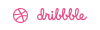
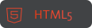
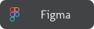
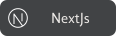

  
  
  

#

  

### About me

-  I'm a 6th semester student of software engineering.
-  I'm currently working with software test automation
-  My family is my greatest treasure
-  I'm passionate about technology and the universe
-  I love coffee

- | ============ ⋆★⋆ ==============|     
        

          
Technology Stack

           
           
           
            
           
           
           
           
           
        

        

          
Operating System & Tools

          

           
           
           
           
           
           
           
          

        

        

          
Others

           
           
           
           
           
           
            
       
