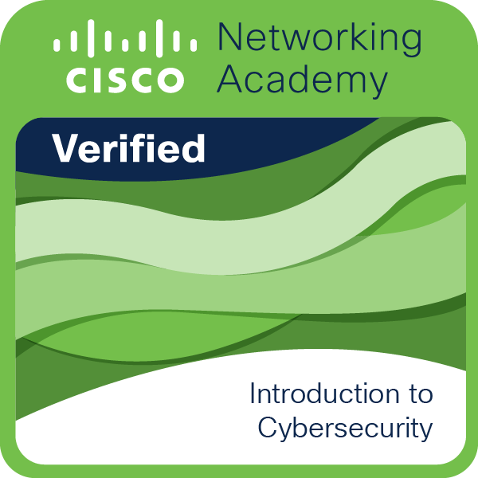

  
  

#

  

### About me

-  I have a degree in software engineering;
-  I'm currently working with software quality;
-  My family is my greatest treasure;
-  I'm passionate about technology and the universe;
-  I really like lo-fi songs;
-  I love coffee.
-  I love using linux

        

          
Technology Stack

           
           
           
           
           
            
           
           
           
        

        

          
Operating System & Tools

          

           
           
           
           
           
           
           
           
           
           
           
           
           
          

        

        

          
Others

           
           
           
           
           
           
           
           
           
            
       

### My dotfiles from Ubuntu 
 [dotfiles](https://github.com/Alencar26/dotfiles)
